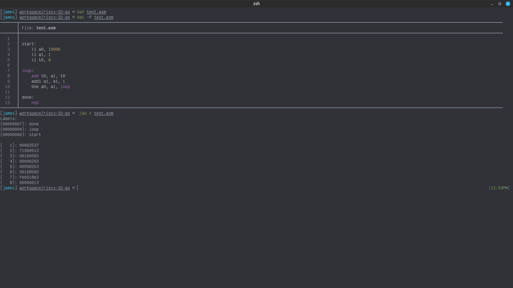

# Risc-V 32-bit Assembler

Accepts a RISC-V assembly program as input and converts it into an assembled binary executable.

The assembler includes the header file `unistd.h`, and uses POSIX `getopt` for
parsing CLI arguments.

## Stages

1. Lexing - Break the input string of characters into lexical tokens
1. Parsing - Assemble the lexical tokens into statements of the grammar
    - It is valid to branch/jump to a label we have not yet parsed, so we cannot
      calculate the offset of any targets yet
1. First Pass - Reverse the list produced by the parser and calculate any label
   offsets
1. Second Pass - Emit the compiled binary instructions

## Debug Mode

Give the assembler the `-v` flag when invoking it and it will print extra
debugging information, such as the symbol table and the line number of each
generated instruction.

The intent is that a person will be reading this output, so it should be
pretty-printed.

## Optimizations

> Use the `-O` flag to enable optimizations, they are disabled by default.

Optimizations performed:

- `nop` can be skipped entirely

### Number Formats

Various number literal formats are recognized, including:

- Decimal (*default*)
  - Character literals, such as `'a'`, are recognized as their ASCII int values
  - Hexadecimal numbers are prefixed by `0x` (or `0X`), such as `0xF123`
  - Binary numbers are prefixed by `0b` (or `0B`), such as `0b10101010`

## Pseudo Instructions

- `li rd, <immediate>`:
  - If immediate can fit in 12 bits then: `addi rd, zero, imm`
  - Otherwise: `lui ...` followed by `addi rd, rd, imm`
- `la rd, <symbol>`: Becomes a `li rd, <immediate>` once the symbol's binary
  offset has been determined

#### Simple

- `not rd, rs1`: one's complement
  - `xori rd, rs1, -1`
- `neg rd, rs1`: two's complement
  - `sub rd, zero, rs1`
- `mv rd, rs1`: copies the value between registers
  - `addi rd, rs1, 0`
- `nop`: *no-operation*
  - `addi zero, zero, 0`

#### Set

- `sgt rd, rs1, rs2`: set on greater than
  - `slt rd, rs2, rs1`
- `sgtu rd, rs1, rs2`: set on greater than (*unsigned*)
  - `sltu rd, rs2, rs1`
- `seqz rd, rs1`: set on equal to zero
  - `sltiu rd, rs1, 1`
- `snez rd, rs1`: set on *not* equal to zero
  - `sltu rd, zero, rs1`
- `sltz rd, rs1`: set on less than zero
  - `slt rd, rs1, zero`
- `sgtz rd, rs1`: set on greater than zero
  - `slt rd, zero, rs1`

#### Branch
- `beqz rs1, <label>`: branch on equal to zero
  - `beq rs1, zero, label`
- `bnez rs1, <label>`: branch on *not* equal to zero
  - `bne rs1, zero, label`
- `bgt rs1, rs2, <label>`: branch on greater than
  - `blt rs2, rs1, label`
- `bltz rs1, <label>`: branch on less than zero
  - `blt rs1, zero, label`
- `bgtz rs1, <label>`: branch on greater than zero
  - `blt zero, rs1, label`
- `ble rs1, rs2, <label>`: branch on equal to zero
  - `beq rs1, zero, label`
- `bgez rs1, <label>`: branch on greater than *or* equal to zero
  - `bge rs1, zero, label`
- `blez rs1, <label>`: branch on less than *or* equal to zero
  - `bge zero, rs1, label`
- `bgtu rs1, rs2, <label>`: branch greater than (*unsigned*)
  - `bltu rs2, rs1, label`
- `bleu rs1, rs2, <label>`: branch less than *or* equal to (*unsigned*)
  - `bgeu rs2, rs1, label`

#### Jump

- `jalr rs1`: automatically writes the *ra* register
  - `jalr ra, 0(rs1)`
- `j <label>`: automatically writes the *zero* register
  - `jal zero, label`
- `jal <label>`: automatically writes the *ra* register
  - `jalr ra, label`
- `jr rs1`: automatically writes the *zero* register
  - `jalr zero, 0(rs1)`
- `ret`: automatically jumps to the *ra* register value
  - `jalr zero, 0(ra)`
- `call <label>`: writes *PC* to a far-away value
  - `auipc ra, (offset[31:12] + offset[11])`
  - `jalr ra, offset[11:0](ra)`

## TODO

- Assembler Directives
- `la` may need to only be one instruction, right now it assumes two are necessary
- Testing
